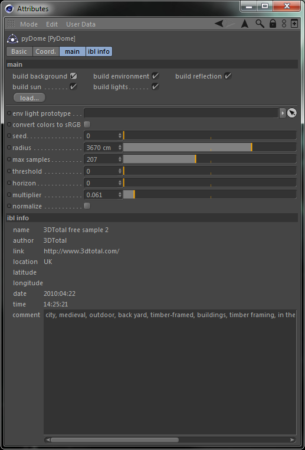

# pyDome

pyDome is a [Smart IBL](http://www.hdrlabs.com/sibl/) loader for Cinema 4D. It has been tested with Cinema 4D R13 and higher.

To use pyDome simply click the **load** button in the pyDome attributes and select an ibl file.

The first set of check boxes control what happens when an ibl file is loaded.

- **build background** - a sky object will be created with the ibl file's *BACKGROUND* information (if available) and it will only be visible to the camera.
- **build environment** - a sky object will be created with the ibl file's *ENVIRONMENT* information (if available) and it will only be visible to global illumination.
- **build reflection** - a sky object will be created with the ibl file's *REFLECTION* information (if available) and it will only be visible to rays (e.g. transparency, reflection, etc...).
- **build sun** - a distant light will be created, colored, and positioned with the ibl file's **SUN** information (if available)
- **build lights** (ibl format v2.0) - a distant light will be created, colored, and positioned for each **LIGHT** defined in the ibl file.

The next group of options control how the virtual light dome is created. The lights will be created using the ibl file's **ENVIRONMENT** image.

- **env light prototype** - you can specify any light object here, and pyDome will use it as the basis for all virtual lights. For example, you can use this to modify the shadow or falloff attributes for the virtual lights. Note, if you modify the light prototype you may have to change a value in the pyDome settings to force an update.
- **convert colors to sRGB** - when enabled, colors read from the **ENVIRONMENT** image will be converted to sRGB colorspace using the gamma 2.2 approximation.
- **seed** - sets the random seed used for sample distribution.
- **radius** - this is the radius of the virtual light dome
- **max samples** - this is the maximum number of virtual lights that will be created. The actual count could be less since pyDome uses rejection sampling for calculating the **threshold**. pyDome will try to reuse samples that have been rejected.
- **threshold** - any colors read from the **ENVIRONMENT** image with an intensity less than **threshold** will be rejected.
- **horizon** - The virtual lights are actually created in a sphere when **horizon** is 0. When **horizon** is set to 0.5, all of the virtual lights will be confined to the northern hemisphere. When **horizon** is set to 1.0, all lights will be confined to the north pole.
- **multiplier** - all virtual light's brightness will be multiplied by this value.
- **normalize** - this tries to keep the sum of all light's brightness at 1.0.